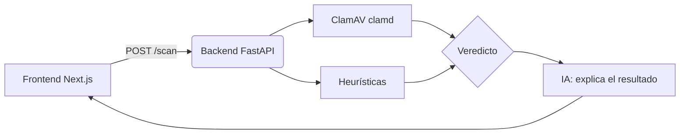

<p align="center">
  
</p>

<p align="center">
  
  
  
</p>

AegisScan es una plataforma de escaneo de archivos: sube un archivo, lo
analiza con ClamAV (motor de firmas de virus real y de código abierto) más
unas señales heurísticas propias, y una IA explica el resultado en lenguaje
llano — qué se ha encontrado y qué hacer al respecto — en vez de dejarte
solo con un código o un "clean"/"infected" sin más contexto.

## Stack

- **Backend**: FastAPI (Python) — recibe el archivo, orquesta el escaneo y la explicación.
- **ClamAV** (`clamd`): motor de firmas de virus, en un contenedor aparte.
- **IA**: un LLM (configurable, por defecto OpenAI `gpt-4o-mini`) redacta la explicación a partir de los metadatos del escaneo — nunca del archivo en sí.
- **Frontend**: Next.js — subir un archivo y ver el resultado.
- **Docker Compose**: levanta las tres piezas juntas para desarrollo local.

## Requisitos

- Docker y Docker Compose.
- (Opcional) una clave de la API de OpenAI si quieres las explicaciones generadas por IA — sin ella, el servicio sigue funcionando con explicaciones locales por reglas fijas.
- Para desarrollar el backend sin Docker en Windows: instala `python-magic-bin` en vez de `python-magic` (ya está resuelto por plataforma en `requirements.txt`, pero si lo instalas a mano en un venv, tenlo en cuenta — `python-magic` a secas no funciona en Windows sin la librería `libmagic`).
- Para desarrollar el frontend sin Docker: Node.js **20.9 o superior** (requisito de Next.js 16). La imagen de Docker (`node:20-slim`) ya lo cumple.

## Instalación

1. Clona el repositorio:
   ```bash
   git clone https://github.com/mark2elisk/aegis-scan.git
   cd aegis-scan
   ```
2. Copia el archivo de variables de entorno:
   ```bash
   cp .env.example .env
   ```
   Rellena `OPENAI_API_KEY` si quieres explicaciones con IA (déjalo vacío,
   o pon `AI_PROVIDER=none`, para usar solo las explicaciones locales).
3. Levanta todo:
   ```bash
   docker compose up --build
   ```

## Configuración

| Variable | Descripción | Dónde conseguirla |
| --- | --- | --- |
| `CLAMD_HOST` / `CLAMD_PORT` | Dónde escucha el daemon de ClamAV. | Ya viene configurado para `docker-compose.yml`; solo cambia si usas tu propia instancia. |
| `MAX_UPLOAD_MB` | Tamaño máximo de archivo admitido. | A tu gusto; por defecto 25 MB. |
| `AI_PROVIDER` | `openai` para explicaciones con IA, `none` para desactivarla. | — |
| `OPENAI_API_KEY` | Clave de la API de OpenAI, si usas `AI_PROVIDER=openai`. | [platform.openai.com/api-keys](https://platform.openai.com/api-keys) |
| `OPENAI_MODEL` | Modelo a usar para la explicación. | Por defecto `gpt-4o-mini`. |
| `CORS_ORIGINS` | Orígenes permitidos, separados por comas. | Por defecto solo `http://localhost:3000`; ponlo al dominio real antes de desplegar. |
| `RATE_LIMIT_PER_MINUTE` | Peticiones a `/scan` permitidas por IP y minuto. | Por defecto 10. |
| `NEXT_PUBLIC_API_URL` | URL del backend que usa el frontend. | Por defecto `http://localhost:8000`. |

Los valores reales van solo en `.env` y nunca se suben al repositorio.

## Ejecución y prueba

Con `docker compose up --build` en marcha:

- Frontend: [http://localhost:3000](http://localhost:3000) — sube un archivo y comprueba que aparece el veredicto (limpio / sospechoso / infectado) con su explicación.
- Backend: [http://localhost:8000/health](http://localhost:8000/health) — comprueba que `clamav_disponible` es `true`.
- Prueba con el archivo estándar [EICAR](https://www.eicar.org/download-anti-malware-testfile/) (un archivo de prueba inofensivo que todos los antivirus detectan a propósito) para confirmar que el veredicto `infectado` funciona de principio a fin.

## Tests

El backend tiene tests unitarios (heurísticas, explicaciones locales de IA) y de los endpoints (`/health`, flujo completo de `/scan` con ClamAV simulado, límite de tamaño, límite de peticiones), que corren sin necesitar ClamAV levantado de verdad:

```bash
cd backend
pip install -r requirements-dev.txt
pytest -v
```

El frontend, por su parte, comprueba tipos (`tsc --noEmit`) y build en CI. Todo se ejecuta automáticamente en cada push y pull request (ver `.github/workflows/tests.yml`).

## Esquema

Diagrama de arquitectura completo, con qué le llega a la IA y qué no, en
[`docs/arquitectura.md`](docs/arquitectura.md).



## Estructura

```
aegis-scan/
├── .github/
│   └── workflows/
│       └── tests.yml          # pytest en cada push/PR
├── backend/
│   ├── app/
│   │   ├── main.py            # endpoint POST /scan y GET /health
│   │   ├── config.py          # configuración desde variables de entorno
│   │   ├── models.py          # modelos de datos (Pydantic)
│   │   ├── scanner/
│   │   │   ├── clamav.py      # wrapper sobre clamd
│   │   │   └── heuristics.py  # entropía, tipo MIME real vs. extensión
│   │   └── ai/
│   │       └── explain.py     # explicación del resultado con IA (o local)
│   ├── tests/                 # tests unitarios y de endpoints
│   ├── requirements.txt
│   ├── requirements-dev.txt
│   └── Dockerfile
├── frontend/
│   ├── app/                   # Next.js (App Router)
│   ├── package.json
│   └── Dockerfile
├── docs/
│   ├── arquitectura.md
│   └── hoja-de-ruta.md        # qué falta para ser un SaaS real
├── assets/
│   └── banner.svg
├── docker-compose.yml
├── .env.example
├── CHANGELOG.md
├── LICENSE
└── README.md
```

## Versiones

| Versión | Fecha | Cambios |
| --- | --- | --- |
| v0.3.0 | 2026-09-23 | Next.js actualizado a 16.3.6 (parcheaba 2 CVE, una de ellas RCE), rechazo temprano de subidas enormes por `Content-Length` (antes de bufferizar el archivo entero) y cobertura de tests ampliada (flujo completo de `/scan`, límite de tamaño, límite de peticiones, explicaciones locales de IA). |
| v0.2.0 | 2026-09-22 | Llamadas bloqueantes movidas a threadpool, CORS configurable, límite de peticiones, cliente de IA reutilizado, tests automáticos y arreglos en el frontend (arrastrar y soltar de verdad). |
| v0.1.0 | 2026-09-22 | Primer MVP: escaneo con ClamAV, heurísticas propias, explicación con IA y frontend mínimo. |

El detalle completo está en [CHANGELOG.md](CHANGELOG.md) y cada versión estable tiene su [release](../../releases).

## Seguridad

- El archivo subido nunca se ejecuta ni se guarda en disco: se analiza en memoria y se pasa a ClamAV por red.
- A la IA solo le llegan los metadatos del escaneo (veredicto, firma, señales heurísticas) — nunca el contenido del archivo.
- Ningún escáner (ni este, ni ningún antivirus comercial) garantiza el 100% frente a amenazas nuevas; un veredicto "limpio" es la mejor información disponible en el momento del análisis, no una garantía absoluta.
- Las subidas con un `Content-Length` por encima de `MAX_UPLOAD_MB` se rechazan antes de parsear el cuerpo, para no bufferizar en memoria/disco un archivo que se va a descartar de todos modos. Esto cubre al cliente que declara el tamaño real; en producción, pon además un límite de tamaño en el proxy/servidor (por ejemplo `client_max_body_size` en nginx), porque un cliente podría enviar un `Content-Length` falso.
- El limitador de peticiones (`RATE_LIMIT_PER_MINUTE`) identifica al cliente por IP de origen de la conexión. Si despliegas detrás de un proxy/balanceador, configúralo para que reenvíe la IP real (`X-Forwarded-For`) o todas las peticiones contarán como si vinieran de una sola IP (la del proxy).

## Licencia

Software propietario. Consulta [LICENSE](LICENSE).

## Contacto

[github.com/mark2elisk](https://github.com/mark2elisk)

© 2026 Mark2Eli.
