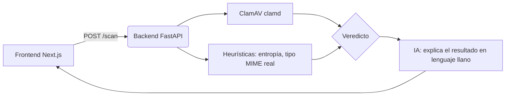

# Arquitectura

## Piezas

- **Frontend** (`frontend/`): Next.js. Sube un archivo, llama a `POST /scan`
  del backend, muestra el veredicto y la explicación.
- **Backend** (`backend/`): FastAPI. Recibe el archivo en memoria (nunca lo
  escribe a disco ni lo ejecuta), lo pasa a ClamAV por red (`clamd`) y calcula
  señales heurísticas propias.
- **ClamAV** (`clamav/clamav` en Docker): motor de firmas de virus real y de
  código abierto. Es quien hace la detección "de verdad"; este proyecto no
  reinventa un antivirus desde cero.
- **Heurísticas** (`backend/app/scanner/heuristics.py`): señales que un motor
  de firmas puede no capturar por sí solo — entropía muy alta (contenido
  empaquetado/cifrado) y extensión que no coincide con el tipo de archivo
  real detectado por `libmagic`.
- **IA** (`backend/app/ai/explain.py`): con el veredicto y las señales ya
  calculadas (nunca con el archivo en sí), un LLM redacta una explicación en
  español y un siguiente paso concreto. Si no hay clave de API configurada,
  se usa una explicación generada localmente con reglas fijas, así el
  servicio sigue funcionando sin depender de un proveedor externo.

## Por qué nunca se envía el archivo a la IA

Dos motivos: privacidad (el archivo puede contener datos del usuario) y
seguridad (no tiene sentido mandar contenido potencialmente malicioso a un
servicio de terceros). El LLM solo ve metadatos ya calculados: veredicto,
firma si la hay, entropía, extensión y tipo MIME.

## Límites conocidos de esta primera versión

- El escaneo es síncrono: para archivos grandes o mucho tráfico haría falta
  una cola (ver `hoja-de-ruta.md`).
- No hay autenticación ni multi-tenant todavía — es un MVP de un solo
  usuario/instancia.
- ClamAV detecta por firmas conocidas; no sustituye un sandbox de análisis
  dinámico para amenazas de día cero.
